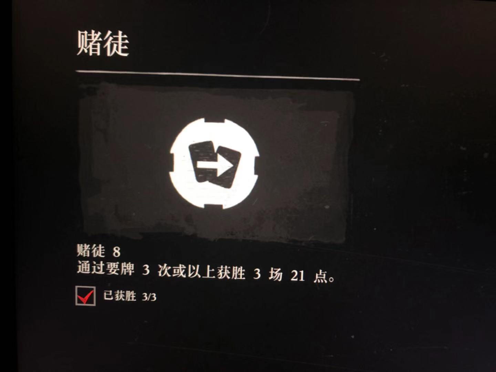

# q01
Question 1

## 题目 / Question
21点游戏，在摸五张牌的情况下，不爆牌的概率。/ Calculating the probability of no burst while fetching 5 cards in blackjack.

## 详细 / Details

21点游戏，英文：Blackjack，是使用扑克牌玩的赌博游戏。

A可作1点或11点，2-10作该牌之点数，J、Q、K作10点。

玩家初始手上有2张牌。

如果玩家要牌后，其手上拥有的牌的总点数超过21点，便要揭开手上所拥有的牌，称为爆牌。

反之若其手上拥有的牌的总点数不超过21点，该玩家可决定是否继续要牌。

假设一个玩家为了完成某项挑战，一定会选择要牌三次，那么对于一局游戏来说，他要牌三次仍未爆牌的概率是多少？


## 背景 / Background
最近在玩R星开发的《荒野大镖客2》游戏，遇到了一个“赌徒系列挑战”之8：



当时耗费了2个小时不停地玩21点，终于完成了这个挑战。

这个挑战在网上被吐槽不少，只要在搜索引擎搜索“赌徒8”，全都是喷这个挑战的。大家都认为这个挑战的运气成分太大，而且完成这个挑战非常困难。

我突发奇想，想计算一下要牌3次还不爆牌的概率。（要牌3次就是有5张手牌）发现这是一个很好的概率题。

当然，对于真正的赌徒8挑战来说，想要算出完成赌徒8需要的期望局数，并不是3/不爆牌的概率。题目对于真正的游戏有一些简化。（尝试抽出最挑战大脑的部分，忽略其他细节，细节写在下面了。）

> 首先，不爆牌并不意味着能赢过庄家，庄家仍有可能比你的5张牌更接近21点；
> 其次，这个游戏没有办法在已经达到21点的时候继续要牌。譬如你起手牌为 `A`和`K`，那么游戏会自动让你停牌，虽然这个时候你仍有可能摸5张牌而不爆，但是游戏机制决定你在这种情况下没办法继续摸牌了。 

## 分析
一共有52张牌。A,2,3,4,5,6,7,8,9,10,J,Q,K各四张。
因为题目要求是不爆牌，所以A看做11点是没有意义的，直接把A当做1点即可。

52张牌中任意选5张，一共有C(52,5)种可能，即2598960种。
剩下的只需要枚举出所有的不爆牌的情形即可。
## Solution01
使用模拟的方法，模拟1000000次情形，并统计不爆牌的次数，得出一个近似概率。

不是特别准确，但是也可以当做一个近似值。但是要真正较真的话，这是一个错误的解法。

实测：
```
$ go run ./s01/main.go
Result is 0.053647
Time consumed 505.888256ms
```

## Solution02
暴力枚举

通过迭代的方式，枚举出每一种方法，并计算出总的不爆牌的方法数目，最终除以总方法数，得到概率值。
该方法的核心点在于模拟。

__算法复杂度__

以总牌数为 `M`， 需要摸的牌数为 `N`，阈值为 `T`。

__时间复杂度__

`O(M^N)` 指数级别，复杂度与阈值无关。

__空间复杂度__

很少，使用函数迭代，还有一个记录扑克的数组，勉强算是消耗 `O(M+N)` 的空间而已，

__实测__
```
go run ./s02/main.go
Result is 0.053856927386339154
Time consumed 7.98652ms
```

## Solution03
状态保留

我们调用`numOfPossibleCases`函数的时候发现，很多参数一模一样的被调用了很多次。
我们建立一个HashMap保存一下状态，当遇到已经吊用过的函数时候，直接返回即可，不需要再次计算。
达到免除重复计算的剪枝效果。

__算法复杂度__

以总牌数为 `M`， 需要摸的牌数为 `N`，阈值为 `T`。

__时间复杂度__

`O(N*T*M^2)` 将指数级别的复杂度降到了多项式级别。

__空间复杂度__

需要用一个 `HashMap` 来暂存状态

复杂度为`O(N*T*M)`

实测：
```
go run ./s03/main.go
Result is 0.053856927386339154
Time consumed 1.408398ms
```

## Solution04
动态规划

var dp [maxCardsToPick + 1][maxThreshold + 1][maxStart + 1]int

dp[i][j][k]的含义为：摸i张牌，最大不超过j，从第k张开始到最后一张牌是可选的范围，那么有几种摸牌的可能性。

状态转移方程：

```
dp[i][j][k] = ∑ (l from k to totalNum) dp[i-1][j-pokers[l]][l+1]
```

__算法复杂度__

以总牌数为 `M`， 需要摸的牌数为 `N`，阈值为 `T`。

__时间复杂度__

`O(N*T*M^2)` 将指数级别的复杂度降到了多项式级别。

__空间复杂度__

建立了一个三维数组 var dp [maxCardsToPick + 1][maxThreshold + 1][maxStart + 1]int
复杂度为`O(N*T*M)`

```
go run ./s04/main.go
Result is 0.053856927386339154
Time consumed 474.663µs
```

## Solution05
优化空间复杂度的动态规划

因为三维数组的每一层只和前面一层有关系，因此可以通过翻转的方式，减少内存消耗。

__算法复杂度__

以总牌数为 `M`， 需要摸的牌数为 `N`，阈值为 `T`。

__时间复杂度__

和 Solution04 一致

__空间复杂度__

建立了一个三维数组 var dp [2][maxThreshold + 1][maxStart + 1]int
复杂度为`O(T*M)`

```
go run ./s05/main.go
Result is 0.053856927386339154
Time consumed 402.794µs
```

---

代码库位置 https://github.com/pkumza/coding/tree/master/q01

附：测试环境
```
MacBook Pro
macOS Mojave 10.14.2
2.4 GHz Intel Core i7
16 GB 1867 MHz LPDDR3
```